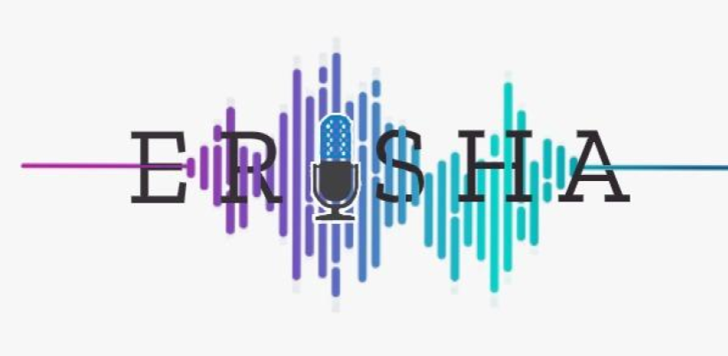

  
# ERISHA: Multispeaker Expressive Text-to-Speech Library

## Ajinkya Kulkarni, Ioannis Douros, Rituporna Dowerah, Vincent Colotte, Denis Jouvet

ERISHA is a multispeaker expressive speech synthesis framework. It can transfer the expressivity to the speaker's voice for which no expressive speech corpus is available. The term ERISHA means speech in Sanskrit. The framework of ERISHA includes various deep learning architectures such as Global Style Token (GST), Variational Autoencoder  (VAE), and Gaussian Mixture Variational Autoencoder (GMVAE), and X-vectors for building prosody encoder. 

Currently, the library is in its initial stage of development and will be updated frequently in the coming days.

Stay tuned for more updates, and we are open to collaboration !!!

## Installation and Training

Refer INSTALL for initial setup

## Available recipes

* [x] [Global Style Token GST](https://arxiv.org/abs/1803.09017)
* [x] [Variational Autoencoder VAE](https://arxiv.org/abs/1812.04342)
* [x] [Gaussian Mixture VAE GMVAE](https://arxiv.org/abs/1810.07217)
* [x] [X-vectors](Proposed work)

## Available Features

* [x] Resampling of speech waveforms to target sampling rate in recipes
* [x] Support to train TTS system for other languages 

## Upcoming updates

* [x] [User Documentation]
* [x] [Pytorch Lightning](https://www.pytorchlightning.ai/)
* [x] [Multiclass N-pair loss](https://hal.archives-ouvertes.fr/hal-02978485/document)
* [x] [Cluster sampling for improving latent representation of speaker and expressivity](Proposed work)

  
## Acknowledgements
This implementation uses code from the following repos: [NVIDIA](https://github.com/NVIDIA/tacotron2), [Keith
Ito](https://github.com/keithito/tacotron/), [Prem
Seetharaman](https://github.com/pseeth/pytorch-stft), 
[Chengqi Deng](https://github.com/KinglittleQ/GST-Tacotron),[Dannynis](https://github.com/Dannynis/xvector_pytorch),
[Jhosimar George Arias Figueroa](https://github.com/jariasf/GMVAE/)

